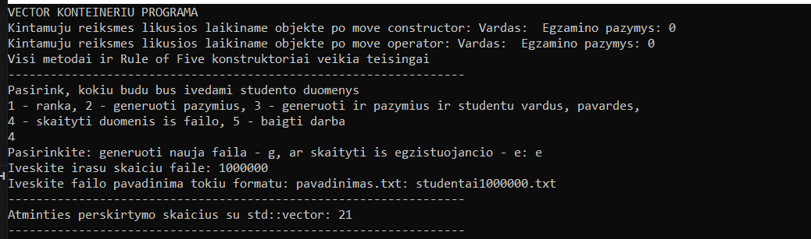
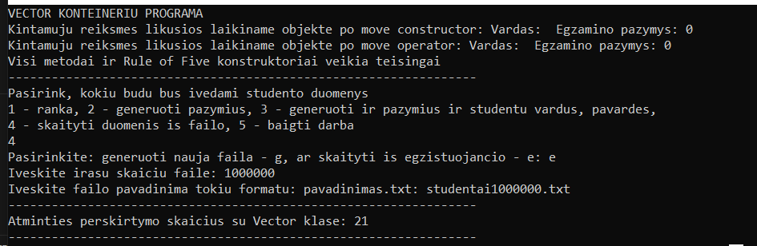

***Objektinio programavimo projektas***

Ši programa skirta darbui su studentų duomenimis, padeda juos valdyti, talpinti ir apdoroti. 

**Funkcijos**
1. Studentų duomenų įvedimas: vardas, pavardė, namų darbų bei egzamino pažymiai.
2. Galimas duomenų įvedimas keturiai skirtingais būdais:
   2.1 Vartotojas įveda visus duomenis
   2.2 Vartotojas įveda vardą ir pavardę, pažymiai yra generuojami
   2.3 Visi studento duomenys yra generuojami
   2.4 Studentų duomenys yra skaitomi iš failo
   2.5 Studentų duomenys skaitomi iš sugeneruoto failo
3. Pasirenkami rūšiavimo parametrai
4. Pasirenkas išvedimo būdas
5. Galutinio pažymio skaičiavimas aritmetinio vidurkio ir medianos būdu

**Klaidų aptikimas**

Kode panaudotas išimčių valdymas (angl. Exception Handling), naudojamas try-catch mechanizmas.

**Duomenys išvedimo failuose yra struktūruoti tokiu būdu:**

|Vardas         |Pavardė        |Galutinis (vid.)  |Galutinis (med.)  |
|---------------|---------------|------------------|------------------|
|VardasNR1      |PavardėNR1     |7.35              |7.76              |
|VardasNR2      |PavardėNR2     |9.28              |9.28              |
|...........    |...........    |......            |........          |

**Programos release'ai:**
- *v.pradine* - primityvi programa, kuri, naudojant struktura, nuskaito vartotoju ivedamus duomenis ir apskaiciuoja ir isveda i ekranavidurkio ir medianos galutinius balus.
- *v0.1* - programa naudoja C masyva ir vector tipo konteinerius. Taip pat irasu skaicius nera zinomas is anksto. Mokiniu balai gali buti generuojami atsitiktinai.
- *v0.2* - naudojama tik vector konteineriu programos versija. Duomenis gali nuskaityti ir is failo. Isvedami studentai turi buti surikiuoti pagal naudotojo pasirinkima: vardas, pavarde, galutinis vidurkio arba galutinis medianos pazymys - didejimo arba mazejimo tvarka.
- *v0.3* - atliekamas ankstesnes kodo versijos reorganizavimas. Funkcijos, nauji duomenu tipai perkeliami i antrastinius (.h) failus ir pan. Implementuojamas isimciu valdymas (angl. Exception Handling).
- *v0.4* - sukuriama failu generatoriaus funkcija. Implementuojamas studentu skirstymas i dvi grupes pagal ju galutini pazymi: pazangus (galutinis balas >= 5.0 ) ir nepazangus (galutinis balas < 5.0). Suskirstyti studentai yra isvedami i du atskirus naujus failus.
- *v1.0* - implementuojamos trys skirtingos programos naudojancios skirtingu tipu konteinerius: deque, vector, list. Optimizuojamas studentu skirtymo i dvi grupes realizacija ivedant tris skirtingas strategijas. Parengta programos idiegimo instrukcija ir paruostas cmake CMakeLists.txt failas.
- *v1.1* - pereinama iš struktūrų duomenų tipo į klasių duomenų tipą. 
- *v1.2* - realizuojami "Rule of five" ir įvesties/išvesties operatoriai. Sukuriamas testas programos metodų, konstruktorių ir destruktoriaus veiklai patikrinti.
- *v1.5* - sukuriamos dvi klasės: bazinė (abstrakti) klasė Zmogus ir iš jos išvestinė (derived) klasė Studentas.
- *v2.0* - sukuriama dokumentacija panaudojant Doxygen. Realizuojami Unit testai.
- *v3.0* - sukurta klasė Vector, kuri pakeičia std::vector. Pilna os implementacija bei spartos palyginimas. Setup failo kūrimas.

**Programu paleisties proceso instrukcija**
1. Isidiekite MinGW (arba MinGW-w64) ir CMake (3.25 arba naujesne versija).
2. Parsisiuskite sia repozitorija su visais failais.
3. Paleiskite ta .bat faila, kuria programa norite paleisti (pvz. jei norite paleisti programa, naudojancia deque konteinerius, tai paleiskite faila DequePrograma.bat).
4. Paleidus .bat faila, programa yra sukonfiguruojama, build'inama ir instaliuojama.
5. Paleiskite programa.

**Studentu skirtymo i dvi grupes strategijos:**
- 1 strategija: Bendras studentu konteineris (vector, list ir deque tipų) skirstomas į du naujus to paties tipo konteinerius: "pazangus" ir "nepazangus".
- 2 startegija: Bendras studentų konteineris (vector, list ir deque) skirstomas panaudojant tik vieną naują konteinerį: "nepazangus". Tokiu būdu, jei studentas yra nepazangus, jį turime įkelti į naująjį "nepazangiu" konteinerį ir ištrinti iš bendro studentai konteinerio. Po šio žingsnio studentai konteineryje liks vien tik pazangus.
- 3 strategija (vector ir deque tipo konteineriu programai): Bendro studentų konteinerio (vector, list ir deque) skirstymas panaudojant greičiausiai veikiancia 1 arba 2 strategiją  bei įtraukiant į ją "efektyvius" darbo su konteineriais metodus (pvz.: std::find, std::find_if, std::search ir tt.).

**Programos testavimo procesas ir rezultatai**

Kiekviena programa yra ištestuojama atskirai, o rezultatai surašomi į bendrą testo laikų failą *laikas.txt* gautų rezultatų palyginimui. 
Testavimo metu yra testuojamos šios programos operacijos:
1. duomenų nuskaitymas iš failų į atitinkamą konteinerį,
2. studentų rikiavimas mazejimo tvarka konteineryje (funkcija sort),
3. studentų skirstymas  į dvi grupes/kategorijas 

---------------------------------------------------------------------------------------------------------------------------------------------------
**1-oji strategija:**

***Programos su vector konteineriais laikai:***
|Failo dydis      |Duomenu skaitymas  |Studentu rikiavimas  |Studentu skirstymas  |
|-----------------|-------------------|---------------------|---------------------|
|1,000 irasu      |  5.80886          |   0.0082508         |    0.0015565        |
|10,000 irasu     |  22.2508          |   0.0132417         |    0.430376         |
|100,000 irasu    |  88.537           |   0.132074          |    2.01038          |
|1,000,000 irasu  |  143.538          |   1.67533           |    3.08502          |
|10,000,000 irasu |     -             |     -               |     -               |

***Programos su list konteineriais laikai:***
|Failo dydis      |Duomenu skaitymas  |Studentu rikiavimas  |Studentu skirstymas  |
|-----------------|-------------------|---------------------|---------------------|
|1,000 irasu      | 6.45228           |   0.0007254         |   0.0038673         |
|10,000 irasu     | 7.7377            |   0.0048768         |   0.0048768         |
|100,000 irasu    | 17.1777           |   0.094924          |   0.363702          |
|1,000,000 irasu  | 105.575           |   2.19874           |   4.59075           |
|10,000,000 irasu |   -               |   -                 |    -                |

***Programos su deque konteineriais laikai:***
|Failo dydis      |Duomenu skaitymas  |Studentu rikiavimas  |Studentu skirstymas  |
|-----------------|-------------------|---------------------|---------------------|
|1,000 irasu      | 6.17446           |  0.0121783          |  0.0040825          |
|10,000 irasu     | 8.67017           |  0.161958           |  0.0483131          |
|100,000 irasu    | 12.7501           |  2.5883             |  0.831552           |
|1,000,000 irasu  | 51.5151           |  18.3511            |  11.8796            |
|10,000,000 irasu |  -                |   -                 |   -                 |

**2-oji strategija**
***Vidutinis programu procesu atlikimo laikas:***
|Failo dydis      |Vector             |List                 |Deque                |
|-----------------|-------------------|---------------------|---------------------|
|1,000 irasu      |  1.38943          |  1.22476            |  1.17204            |
|10,000 irasu     |  4.67764          |  1.31443            |  1.51357            |
|100,000 irasu    |  14.4621          |  2.9182             |  2.94067            |
|1,000,000 irasu  |  27.684           |  21.1924            |  26.8105            |

**3-oji strategija**
***Vidutinis programu procesu atlikimo laikas:***
|Failo dydis      |Vector             |List                 |Deque                |
|-----------------|-------------------|---------------------|---------------------|
|1,000 irasu      |   1.14182         |   1.5644            |  1.41839            |
|10,000 irasu     |   5.72131         |   1.99268           |  1.36497            |
|100,000 irasu    |   20.9568         |   6.1044            |  3.47975            |
|1,000,000 irasu  |   41.0175         |   25.4123           |  31.0889            |

---------------------------------------------------------------------------------------------------------------------------------------------------

**Strukturos ir klases programu spartos palyginimas**
|Failo dydis      |Struct             |Class                |
|-----------------|-------------------|---------------------|
|100,000          |  20.9568          |  3.50327            |
|1,000,000        |  41.0175          |  5.69491            |

---------------------------------------------------------------------------------------------------------------------------------------------------

**Kompiliatoriaus optimizavimo lygio tyrimas**
|Optimizacijos flag'as   |Laikas 100,000 irasu  | Laikas 1,000,000 irasu  |
|------------------------|----------------------|-------------------------|
|-o1                     |   3.51606            |   4.68643               |
|-o2                     |   2.62769            |   4.96555               |
|-o3                     |   2.64526            |   4.66363               |

**std::vector ir Vector tuščių vektorių užpildymo, naudojant push_back(), laiko palyginimas**
|Įrašų skaičius          |Laikas std::vector    | Laikas Vector           |
|------------------------|----------------------|-------------------------|
|10,000                  |6.19009               |5.96799                  |
|100,000                 |8.11821               |7.95788                  |
|1,000,000               |21.9003               |20.1865                  |

**Isvada:** Programos veikimo sparta praktiskai nekito, naudojant skirtingus optimizavimo flag'us. Tačiau didelėse programose sie, is paziuros minimalus skirtumai butu labai svarbus.

--------------------------------------------------------------------------------------------------------------------------------------

Taip pat kiekvienos programos veikimo metu yra sugeneruojamas failas su CPU, RAM ir disko apkrovos duomenimis programos testavimo metu.

**Rezultatų pvz.:**

***Vector konteineris:***

CPU usage: LoadPercentage  18              
RAM usage: RAM naudojimas: 95%
Disk usage:
FreeSpace    Name  Size          
27100065792  C:    254761791488  

***List konteineris:***

CPU usage: LoadPercentage  13              
RAM usage: RAM naudojimas: 93%
Disk usage:
FreeSpace    Name  Size          
27226103808  C:    254761791488  

***Deque konteineris:***

CPU usage: LoadPercentage  28   
RAM usage: RAM naudojimas: 92%
Disk usage:
FreeSpace    Name  Size          
27336642560  C:    254761791488  

**Sistemos parametrai:**

- CPU Intel(R) Core(TM) i3-10110U CPU @ 2.10GHz, 2592 Mhz, 2 Core(s), 4 Logical Processor(s) 
- RAM 4,00 GB
- Disk SSD 239 GB

**Testavimo išvados:**
Remiantis programos operacijų laikais, efektyviausiai veikianti programa naudoja deque konteinerius, o mažiausiai efektyvi programa naudoja vector konteinerius. (Galimi testavimo neatitikimai, kurie priklauso nuo sistemos parametru).

**Testvimo metodas programos metodu ir konstruktoriu testavimui**
Metodas *test* ištestuoja programos metodų ir konstruktorių veiklą. Jei viskas veikia - ekrane išspausdinama žinutė: " Visi metodai ir Rule of Five konstruktoriai veikia teisingai", jei aptinkamos klaidos - programos veikla nutrūksta. 

**Perdengti operatoriai**
programoje naudoami perdengti operatoriai įvesčiai ir išvesčiai. Perdengti operatoriai leidžia iš naujo apibrėžti standartinių operatorių veiklą, kai jie yra naudojami su klasės objektais. Tai padaro class'ės naudojimą lengvesnį ir intuityvesnį. 

**Unit testing**
Realizuoti du Unit testai, kurie testuoja Studento klasės konstruktorius, getter'ius bei The Rule of Five.

**Vector klasės metodų pvz.**
*push_back metodas*
template <typename T>
void ManoVektorius<T>::push_back(const T& value) {
   if (size_ == capacity_) {
        reallocate(capacity_ == 0 ? 1 : capacity_ * 2);
    }
    data_[size_++] = value;
   }

*operator[] metodas*
template <typename T>
const T& ManoVektorius<T>::operator const {
    return data_[index];
}

*back() metodas*
template <typename T>
T& ManoVektorius<T>::back() {
    return data_[size_ - 1];
}

*begin() metodas*
template <typename T>
T* ManoVektorius<T>::begin() {
    return data_;
}

*end() metodas*
template <typename T>
T* ManoVektorius<T>::end() {
    return data_ + size_;
}

**Atminties pertvarkymų (reallocation) skaičius naudojant std::vector ir Vector**

**Programos veikimo laiko palyginimas su std::vector ir Vector klase**
|Įrašų skaičius          |Laikas std::vector    | Laikas Vector           |
|------------------------|----------------------|-------------------------|
|10,000                  |6.19009               |21.7113                  |
|100,000                 |8.11821               |33.5313                  |
|1,000,000               |21.9003               |229.146                  |

